# OmniNFT 架构全景

> 文档版本: v1.1 · 最后更新: 2026-08-28

本文档梳理 OmniNFT 的完整调用链、类图、时序图，以及 rollout → reward → trainer adapter 之间传递的所有数据字段。目标读者是后续 Stage 3+ 的 actor 训练接入开发者。

> v1.1 变更: 奖励链路重构（commit `776f2be`）——batch 奖励执行从通用 `OmniRewardLoopManager` 中隔离出来，迁移到新的 `MultiModalRewardLoopManager` / `MultiModalRewardLoopWorker` / `BatchRewardCoordinator` 栈（`verl_omni/reward_loop/multimodal_reward_loop.py`）；`OmniRewardLoopManager` 仅保留 profiler 扩展。

---

## 目录

1. [架构总览](#1-架构总览)
2. [Rollout 调用链](#2-rollout-调用链)
3. [Reward 调用链](#3-reward-调用链)
4. [类图](#4-类图)
5. [时序图](#5-时序图)
6. [数据字段清单](#6-数据字段清单)
7. [关键数据缺口](#7-关键数据缺口)
8. [未来 Adapter 实现清单](#8-未来-adapter-实现清单)

---

## 1. 架构总览

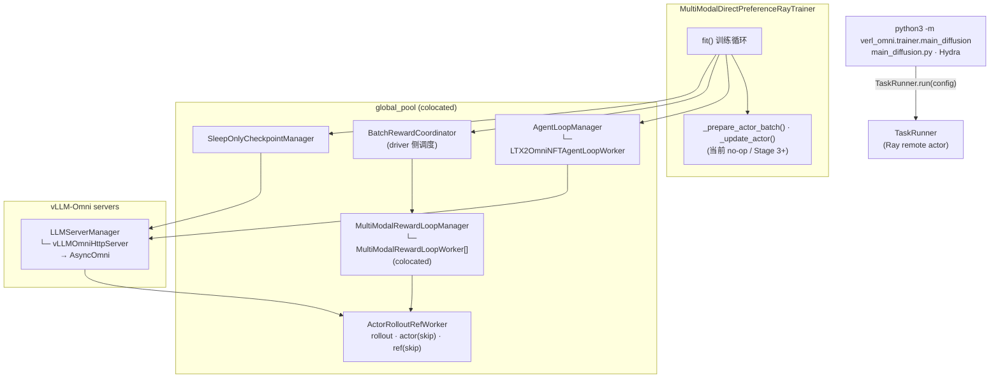

---

## 2. Rollout 调用链

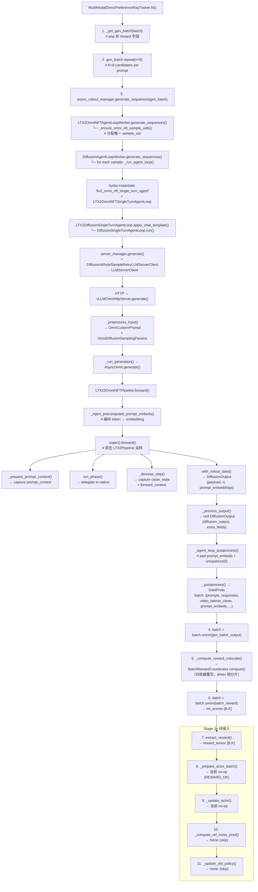

---

## 3. Reward 调用链

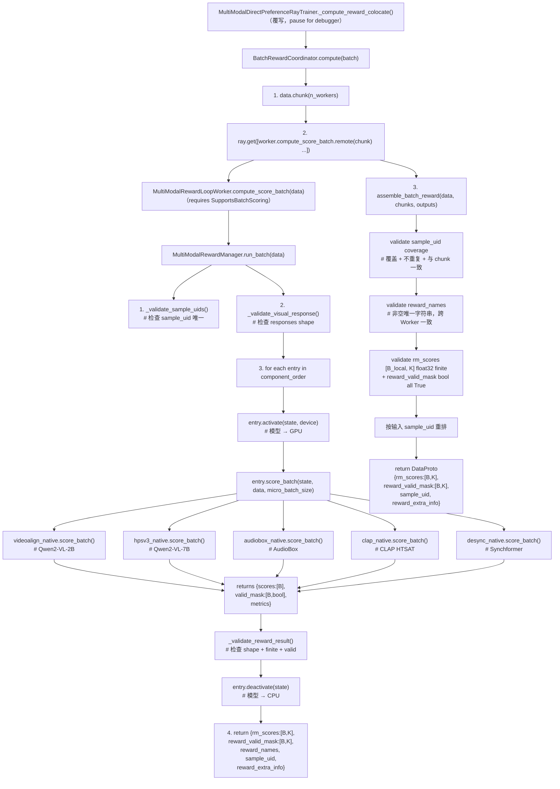

### 5 个原生奖励模块

| 模块 | 模型 | 评分维度 | 参数量 |
|------|------|---------|--------|
| **VideoAlign** | Qwen2-VL-2B-Instruct | VQ (视觉质量), MQ (运动质量), TA (文本对齐) | ~2B |
| **HPSv3** | Qwen2-VL-7B-Instruct | 人类偏好评分 | ~7B |
| **AudioBox** | facebook/audiobox-aesthetics | 音频美学 (CE, CU, PC, PQ) | ~200M |
| **CLAP** | laion/clap-htsat-unfused | 文本-音频对齐 cosine similarity | ~300M |
| **DeSync** | Synchformer | 音视频同步 | ~300M |

---

## 4. 类图

### 4.1 Trainer 层

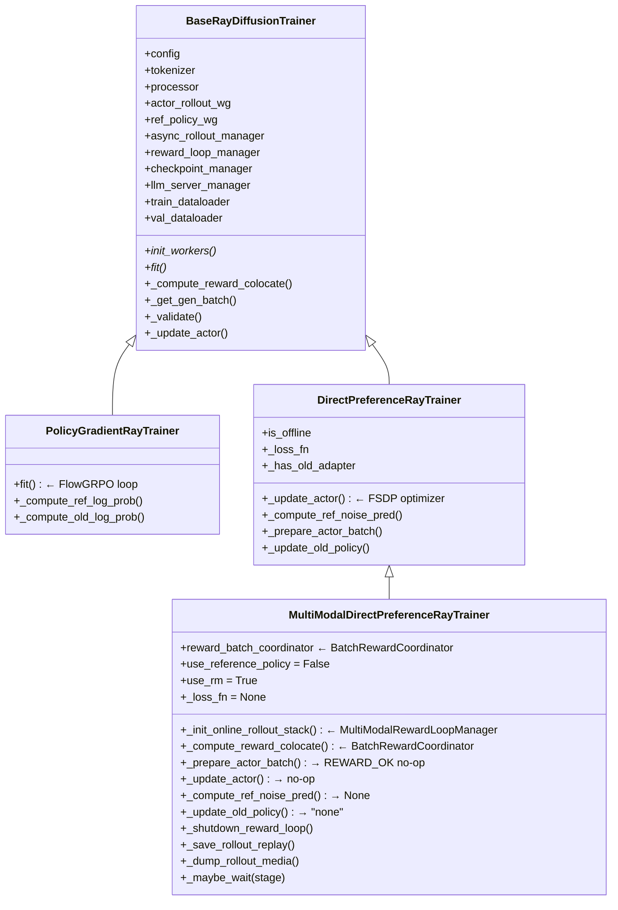

### 4.2 Pipeline 层

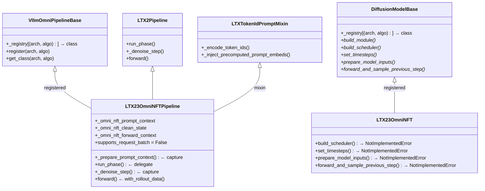

### 4.3 Agent Loop 层

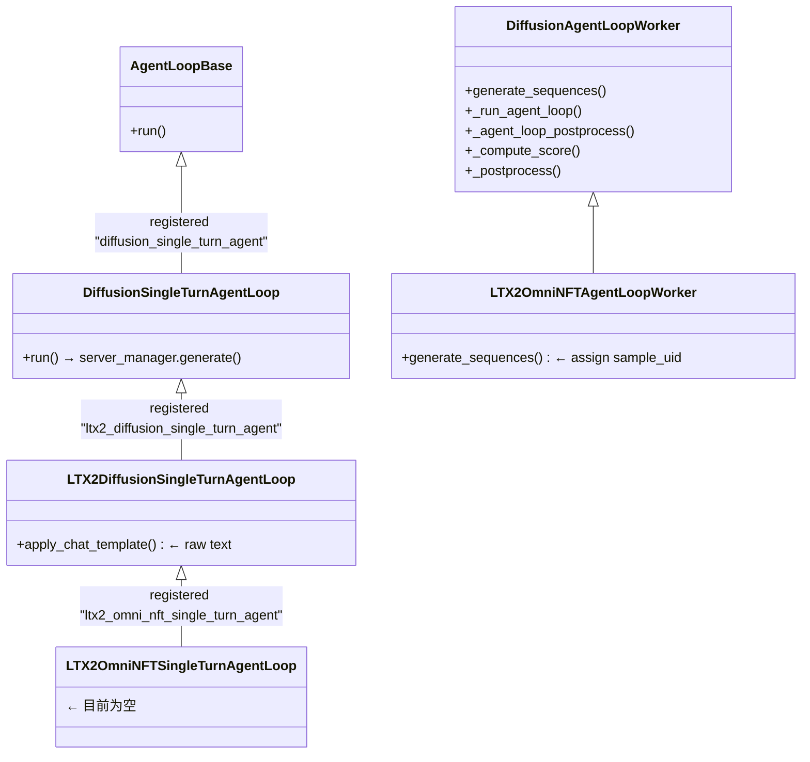

### 4.4 Reward 层

```mermaid
classDiagram
    class RewardLoopManager {
        +compute_rm_score()
    }

    class OmniRewardLoopManager {
        +start_profile()
        +stop_profile()
        +_run_on_replicas()
    }

    class MultiModalRewardLoopManager {
        +_init_reward_loop_workers()  ← accelerator-bound Workers
        +shutdown()
        +_resource_pool
        +reward_loop_workers[]
    }

    class RewardLoopWorker {
        +compute_score()
    }

    class MultiModalRewardLoopWorker {
        +compute_score_batch()  ← requires SupportsBatchScoring
        +shutdown()
    }

    class BatchRewardCoordinator {
        +worker_handles
        +compute()  ← chunk + dispatch + assemble
    }

    class SupportsBatchScoring {
        <<Protocol>>
        +run_batch()
    }

    class MultiModalRewardManager {
        +component_order
        +_reward_entries
        +run_batch()  → {rm_scores:[B,K], sample_uid, ...}
        +run_single()
        +shutdown()
    }

    class RewardRuntimeEntry {
        +name
        +state
        +activate()
        +score_batch()
        +deactivate()
        +finalize()
        +micro_batch_size
    }

    class VisualRewardManager {
    }

    class MultiVisualRewardManager {
    }

    RewardLoopManager <|-- OmniRewardLoopManager
    RewardLoopManager <|-- MultiModalRewardLoopManager
    RewardLoopWorker <|-- MultiModalRewardLoopWorker
    VisualRewardManager <|-- MultiVisualRewardManager
    MultiVisualRewardManager <|-- MultiModalRewardManager
    MultiModalRewardManager ..|> SupportsBatchScoring
    MultiModalRewardManager *-- RewardRuntimeEntry : contains
    MultiModalRewardLoopManager --> MultiModalRewardLoopWorker : spawns
    BatchRewardCoordinator --> MultiModalRewardLoopWorker : dispatches
    BatchRewardCoordinator --> SupportsBatchScoring : validates
```

> 说明：`OmniRewardLoopManager`（`reward_loop/reward_loop.py`）仅保留 reward-model rollout server 的 profiler 扩展；OmniNFT 的 batch 奖励走 `MultiModalRewardLoopManager`（`reward_loop/multimodal_reward_loop.py`）。`assemble_batch_reward()` 是独立的校验 + 组装函数，由 `BatchRewardCoordinator.compute()` 调用。

### 4.5 Worker 层

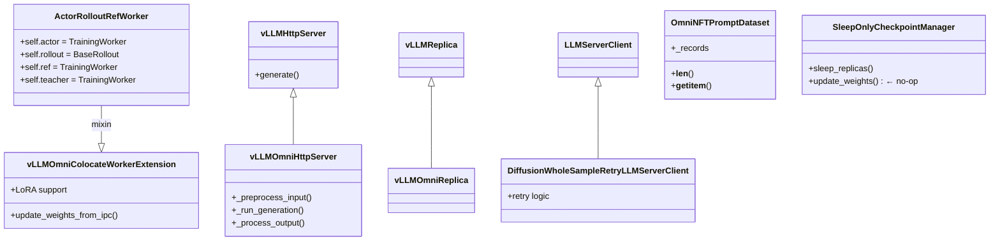

---

## 5. 时序图

### 5.1 训练启动

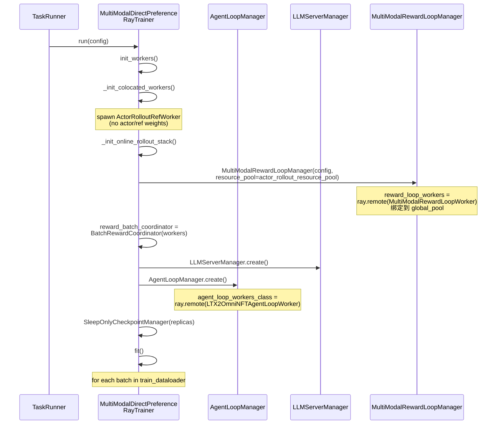

### 5.2 单步训练 (Rollout + Reward)

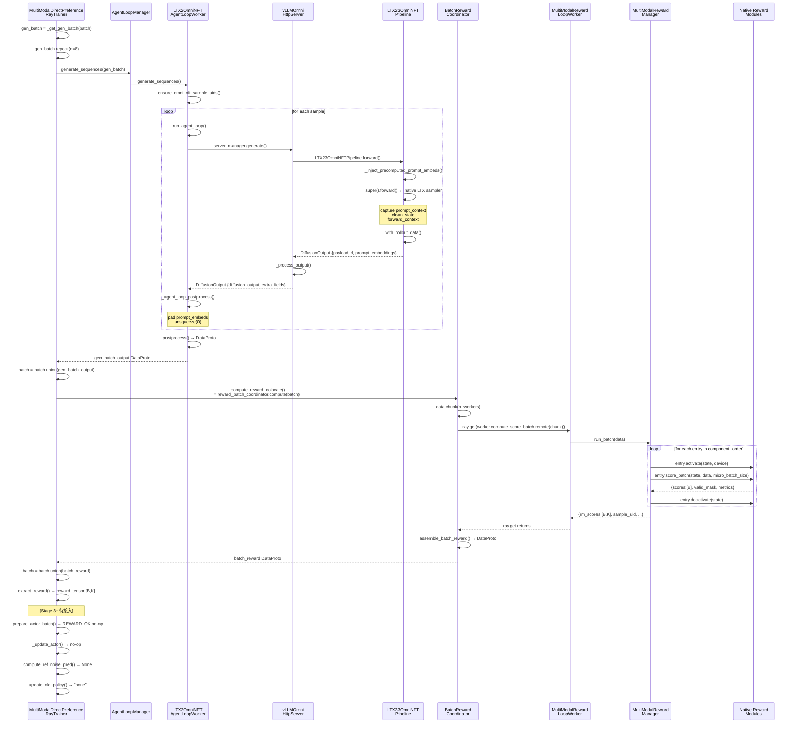

### 5.3 Reward 评分 (Batch 模式)

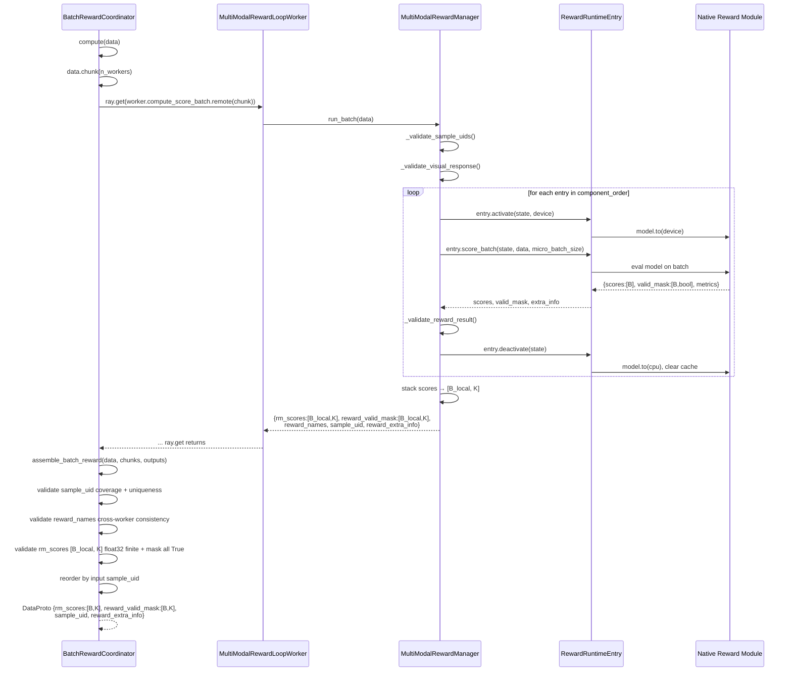

---

## 6. 数据字段清单

### 6.1 Rollout 产出字段 (`batch.batch` TensorDict)

| 优先级 | # | 字段名 | 类型/Shape | 来源 | 将来 Adapter 消费 |
|-------|---|--------|-----------|------|------------------|
| 🔴 | 1 | `prompt_embeds` | `float32 [B, L, D]` | LTX text_encoder → `prompt_embeddings` | `prepare_model_inputs` → `hidden_states` |
| 🔴 | 2 | `audio_prompt_embeds` | `float32 [B, L_a, D_a]` | LTX audio text_encoder → `prompt_embeddings` | `prepare_model_inputs` → `audio_encoder_hidden_states` |
| 🔴 | 3 | `prompt_embeds_mask` | `bool/float [B, L]` | LTX attention_mask → `prompt_embeddings` | `prepare_model_inputs` → `attention_mask` |
| 🔴 | 4 | `video_latents_clean` | `float32 [B, T, C, H, W]` | `clean_state.video` → `rl` | **需映射为 `latents_clean` 的一部分** |
| 🔴 | 5 | `audio_latents_clean` | `float32 [B, T_a, ...]` | `clean_state.audio` → `rl` | **需映射为 `latents_clean` 的一部分** |
| 🔴 | 6 | `train_timesteps` | `float32 [B, T_steps]` | `forward_context.timesteps` → `rl` | `_select_train_timesteps` → noising |
| 🔴 | 7 | `video_seq_len` | `int64 [B]` | `clean_state.video.shape[1]` → `rl` | **联合 latent 分割边界** |
| 🔴 | 8 | `audio_seq_len` | `int64 [B]` | `clean_state.audio.shape[1]` → `rl` | **联合 latent 分割边界** |
| 🟡 | 9 | `negative_prompt_embeds` | `float32 [B, L, D]` | LTX negative text_encoder → `prompt_embeddings` | CFG 负向输入 |
| 🟡 | 10 | `negative_audio_prompt_embeds` | `float32 [B, L_a, D_a]` | LTX negative audio text_encoder → `prompt_embeddings` | CFG 负向音频输入 |
| 🟡 | 11 | `negative_prompt_embeds_mask` | `bool/float [B, L]` | LTX negative mask → `prompt_embeddings` | CFG 负向 mask |
| 🟡 | 12 | `video_latent_shape` | `int64 [B, ndim]` | `clean_state.video.shape[1:]` → `rl` | Adapter 维度配置 |
| 🟡 | 13 | `audio_latent_shape` | `int64 [B, ndim]` | `clean_state.audio.shape[1:]` → `rl` | Adapter 维度配置 |
| 🟢 | 14 | `prompts` | `int64 [B, prompt_length]` | Agent loop tokenizer pad | `embeds_padding_2_no_padding` → 丢弃 |
| 🟢 | 15 | `responses` | `uint8 [B, T, C, H, W]` | VAE decode → uint8 | 验证/日志 dump |
| 🟢 | 16 | `rollout_log_probs` | `float32 [B, ...]` (可选) | 服务器 `log_probs` | bypass mode old_log_probs |
| 🟢 | 17 | `attention_mask` | `[B, prompt_length]` | Tokenizer pad | — |
| 🟢 | 18 | `audio` | `float32 [B, ...]` | VAE audio decode → `rl` | 验证、reward |
| 🟢 | 19 | `fps` | `float32 [B]` | `request_inputs.frame_rate` → `rl` | 验证视频 muxing |
| 🟢 | 20 | `audio_sample_rate` | `int64 [B]` | `vocoder.config.output_sampling_rate` → `rl` | 验证音频 muxing |
| 🟢 | 21 | `all_latents` | `[B, ...]` (可选) | 服务器 trajectory_latents | 未来轨迹日志 |
| 🟢 | 22 | `all_timesteps` | `[B, ...]` (可选) | 服务器 trajectory_timesteps | 未来轨迹日志 |

> 🔴 = 必须接入 | 🟡 = 可能需要 | 🟢 = 辅助/可选

### 6.2 Reward 产出字段

| 优先级 | # | 字段名 | 类型/Shape | 来源 | 说明 |
|-------|---|--------|-----------|------|------|
| 🔴 | 23 | `rm_scores` | `float32 [B, K]` | `MultiModalRewardManager.run_batch()` → `BatchRewardCoordinator` | K=5 个奖励组件原始分数，跨 Worker 验证 finite |
| 🔴 | 24 | `reward_valid_mask` | `bool [B, K]` | 同上 | 有效性掩码；`assemble_batch_reward` 要求 `all()` 为 True |
| 🔴 | 25 | `sample_uid` | `object [B]` | `_ensure_omni_nft_sample_uids()` | 唯一 rollout ID，用于 reward batch 对齐；跨 Worker 不重复、覆盖全量 |
| 🔴 | 26 | `reward_names` | `list[str]` (meta_info) | `component_order` | `["video_align", "hpsv3", "audiobox", "clap", "desync"]`；`assemble_batch_reward` 要求跨 Worker 一致 |
| 🟢 | 27 | `reward_extra_info` | `dict [B]` → `dict[name → {metrics, model_revision, definition_version}]` | `MultiModalRewardManager` | 每个组件输出 metrics，按 reward name 索引；`assemble_batch_reward` 要求 key 覆盖全部 reward_names |

### 6.3 Trainer 组装后字段

| 优先级 | # | 字段名 | 类型/Shape | 计算方式 | 说明 |
|-------|---|--------|-----------|---------|------|
| 🔴 | 28 | `sample_level_scores` | `float32 [B, K]` | `extract_reward()` → `rm_scores` | 即 `rm_scores` |
| 🟡 | 29 | `sample_level_rewards` | `float32 [B, K]` | `= sample_level_scores` | DiffusionNFT 中展开为 `[B, T]` 后使用 |

### 6.4 Dataset 携带字段 (`batch.non_tensor_batch`)

| 优先级 | # | 字段名 | 类型 | 说明 |
|-------|---|--------|------|------|
| 🔴 | 30 | `uid` | `object [B]` | 每个 prompt 的唯一 ID，用于 GRPO 分组 |
| 🟢 | 31 | `data_source` | `object [B]` | 数据集来源标识 |
| 🟢 | 32 | `reward_model` | `object [B]` | 数据集中的 ground_truth 等信息 |
| 🟢 | 33 | `extra_info` | `object [B]` | 数据集额外信息 |
| 🟢 | 34 | `raw_prompt` | `object [B]` | 原始 prompt 字符串 |
| 🟢 | 35 | `global_steps` | `object [B]` | 当前 global step |
| 🟢 | 36 | `_rollout_seed_global_idx` | `int64 [B]` | 全局 rollout seed 索引 |
| 🟢 | 37 | `agent_name` | `object [B]` | agent loop 名称 |

---

## 7. 关键数据缺口

### 7.1 `latents_clean` vs `video_latents_clean` + `audio_latents_clean`

`DiffusionNFTLoss.prepare_actor_batch()` 和 `NFTDiffusersFSDPEngine.prepare_model_inputs()` 都期望读 `batch.batch["latents_clean"]`（单个张量），但 LTX OmniNFT rollout 产出了两个独立的 clean latent：

```python
# 当前 rollout 产出
video_latents_clean: [B, T_v, C_v, H_v, W_v]  # 视频 latent
audio_latents_clean: [B, T_a, C_a, H_a, W_a]  # 音频 latent

# 未来 adapter 需要处理成
latents_clean = cat([video_latents_clean, audio_latents_clean], dim=1)  # 联合 latent
```

**参考实现**: `LTX23FlowGRPO` 在 `prepare_model_inputs` 中用 `video_seq_len` 分割联合 latent：

```python
video_latents = latents[:, :video_seq_len]
audio_latents = latents[:, video_seq_len:]
```

### 7.2 `audio_prompt_embeds` 的传递

`DiffusionNFTLoss` 和 `NFTDiffusersFSDPEngine` 的标准路径只传递 `prompt_embeds/prompt_embeds_mask/negative_prompt_embeds/negative_prompt_embeds_mask`，没有 `audio_prompt_embeds` 和 `negative_audio_prompt_embeds`。未来的 `LTX23OmniNFT` adapter 需要**重写 `prepare_model_inputs`** 将 `audio_prompt_embeds` 注入到 `model_inputs["audio_encoder_hidden_states"]`。

### 7.3 `reward_prob` 的计算

`DiffusionNFTLoss.prepare_actor_batch()` 流程：

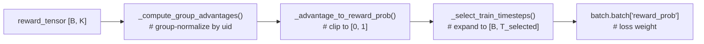

当前 `MultiModalDirectPreferenceRayTrainer._prepare_actor_batch()` 是 no-op（跳过此流程）。未来 adapter 接入时需要调用 `DiffusionNFTLoss.prepare_actor_batch()` 来完成此转换。

### 7.4 当前状态总结

| 组件 | 状态 | 文件 |
|------|------|------|
| Rollout Pipeline | ✅ 完整实现 | `pipelines/ltx2_omni_nft/vllm_omni_rollout_adapter.py` |
| Agent Loop | ✅ 完整实现 | `pipelines/ltx2_omni_nft/agent_loop.py` |
| Reward 系统 (Manager) | ✅ 完整实现 | `reward_loop/reward_manager/multimodal.py` |
| Reward 系统 (Loop + Coordinator) | ✅ 完整实现 (v1.1 重构) | `reward_loop/multimodal_reward_loop.py` |
| Reward 系统 (Profiler) | ✅ 完整实现 | `reward_loop/reward_loop.py` |
| Trainer 基础 | ✅ 完整实现 | `trainer/diffusion/ray_diffusion_trainer.py` |
| Training Adapter `LTX23OmniNFT` | ❌ 未实现 (stub) | `pipelines/ltx2_omni_nft/diffusers_training_adapter.py` |
| Loss 注册 `omni_nft` | ❌ 未注册 | `trainer/diffusion/diffusion_algos.py` |
| 模型引擎 `omni_nft_model` | ❌ 未实现 | `workers/engine/` |

---

## 8. 未来 Adapter 实现清单

### 8.1 `LTX23OmniNFT` 需实现的抽象方法

`DiffusionModelBase` 的 4 个抽象方法：

```python
class LTX23OmniNFT(DiffusionModelBase):
    # 1. 构建调度器
    @classmethod
    def build_scheduler(cls, model_config) -> SchedulerMixin:
        # 需要: FlowMatchSDEDiscreteScheduler 或 LTX 自定义 scheduler
        raise NotImplementedError

    # 2. 设置 timesteps
    @classmethod
    def set_timesteps(cls, scheduler, model_config, device):
        # 需要: 匹配 LTX sigma schedule
        raise NotImplementedError

    # 3. 准备模型输入
    @classmethod
    def prepare_model_inputs(cls, module, model_config, latents, timesteps,
                             prompt_embeds, prompt_embeds_mask,
                             negative_prompt_embeds, negative_prompt_embeds_mask,
                             micro_batch, step):
        # 需要:
        #   1) 从 micro_batch 读取 audio_prompt_embeds 注入 audio_encoder_hidden_states
        #   2) 从 micro_batch 读取 video_seq_len/audio_seq_len 处理联合 latent 分割
        #   3) 处理 video/audio 的 CFG 负向输入
        raise NotImplementedError

    # 4. 前向 + 采样上一步
    @classmethod
    def forward_and_sample_previous_step(cls, ...):
        # DiffusionNFT 使用 forward() 直接预测，此方法可能不需要完整实现
        raise NotImplementedError
```

### 8.2 Loss 路径

```python
DiffusionNFTLoss  # 已实现，可直接使用
    prepare_actor_batch(batch, reward_tensor, config)
        # 需要:
        #   batch.batch["latents_clean"]      ← 需映射 video_latents_clean + audio_latents_clean
        #   batch.batch["train_timesteps"]
        #   batch.non_tensor_batch["uid"]     ← 用于 group normalization
        # 返回:
        #   batch.batch["reward_prob"]        ← [B, T] optimality probability

    compute_loss(batch, model_outputs)
        # 需要:
        #   model_outputs["forward_prediction"]
        #   model_outputs["old_prediction"]
        #   model_outputs["ref_forward_prediction"]
        #   model_outputs["x0"], model_outputs["xt"], model_outputs["t_expanded"]
        #   batch.batch["reward_prob"]
```

### 8.3 注册需求

```python
# 1. 注册 Training Adapter
@DiffusionModelBase.register("LTX2Pipeline", algorithm="omni_nft")
class LTX23OmniNFT(DiffusionModelBase):
    ...

# 2. 注册 Loss
register_diffusion_loss("omni_nft", DiffusionNFTLoss)

# 3. 实现模型引擎 (omni_nft_model)
# 文件: workers/engine/ 下新建 nft_omni_engine.py
# 继承 NFTDiffusersFSDPEngine 或新建
```

---

## 附录: 关键文件索引

| 作用域 | 文件路径 | 核心类 |
|--------|---------|--------|
| 入口 | `verl_omni/trainer/main_diffusion.py` | `TaskRunner`, `_get_trainer_cls()` |
| Trainer | `verl_omni/trainer/diffusion/ray_diffusion_trainer.py` | `MultiModalDirectPreferenceRayTrainer` |
| Loss | `verl_omni/trainer/diffusion/diffusion_algos.py` | `DiffusionNFTLoss` |
| Rollout Adapter | `verl_omni/pipelines/ltx2_omni_nft/vllm_omni_rollout_adapter.py` | `LTX23OmniNFTPipeline` |
| Training Adapter | `verl_omni/pipelines/ltx2_omni_nft/diffusers_training_adapter.py` | `LTX23OmniNFT` (stub) |
| Prompt Mixin | `verl_omni/pipelines/ltx2_omni_nft/prompt_mixin.py` | `LTXTokenIdPromptMixin` |
| Agent Loop | `verl_omni/pipelines/ltx2_omni_nft/agent_loop.py` | `LTX2OmniNFTAgentLoopWorker` |
| Rollout Output | `verl_omni/pipelines/diffusion_rollout_output.py` | `with_rollout_data()` |
| Pipeline Base | `verl_omni/pipelines/model_base.py` | `VllmOmniPipelineBase`, `DiffusionModelBase` |
| Rollout Server | `verl_omni/workers/rollout/vllm_rollout/vllm_omni_async_server.py` | `vLLMOmniHttpServer` |
| Reward Loop (Profiler) | `verl_omni/reward_loop/reward_loop.py` | `OmniRewardLoopManager` |
| Reward Loop (Batch) | `verl_omni/reward_loop/multimodal_reward_loop.py` | `MultiModalRewardLoopManager`, `MultiModalRewardLoopWorker`, `BatchRewardCoordinator`, `assemble_batch_reward` |
| Reward Manager | `verl_omni/reward_loop/reward_manager/multimodal.py` | `MultiModalRewardManager` |
| Dataset | `verl_omni/utils/dataset/omni_nft_dataset.py` | `OmniNFTPromptDataset` |
| Agent Loop Base | `verl_omni/agent_loop/diffusion_agent_loop.py` | `DiffusionAgentLoopWorker` |
| Agent Loop Loop | `verl_omni/agent_loop/single_turn_agent_loop.py` | `DiffusionSingleTurnAgentLoop` |
| Native Reward | `verl_omni/utils/reward_score/videoalign_native.py` | `score_batch()` |
| Native Reward | `verl_omni/utils/reward_score/hpsv3_native.py` | `score_batch()` |
| Native Reward | `verl_omni/utils/reward_score/audiobox_native.py` | `score_batch()` |
| Native Reward | `verl_omni/utils/reward_score/clap_native.py` | `score_batch()` |
| Native Reward | `verl_omni/utils/reward_score/desync_native.py` | `score_batch()` |